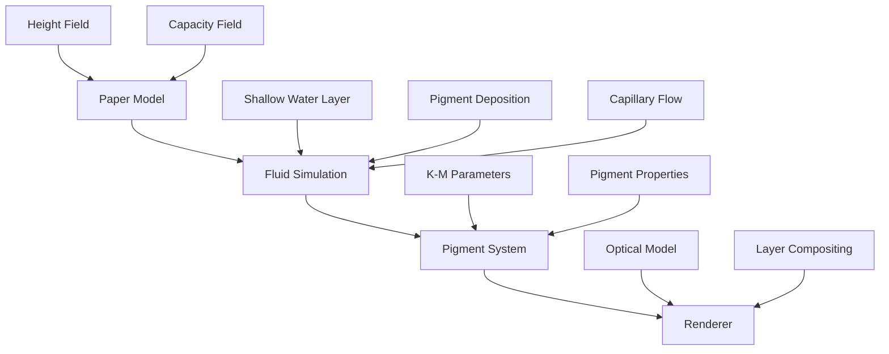
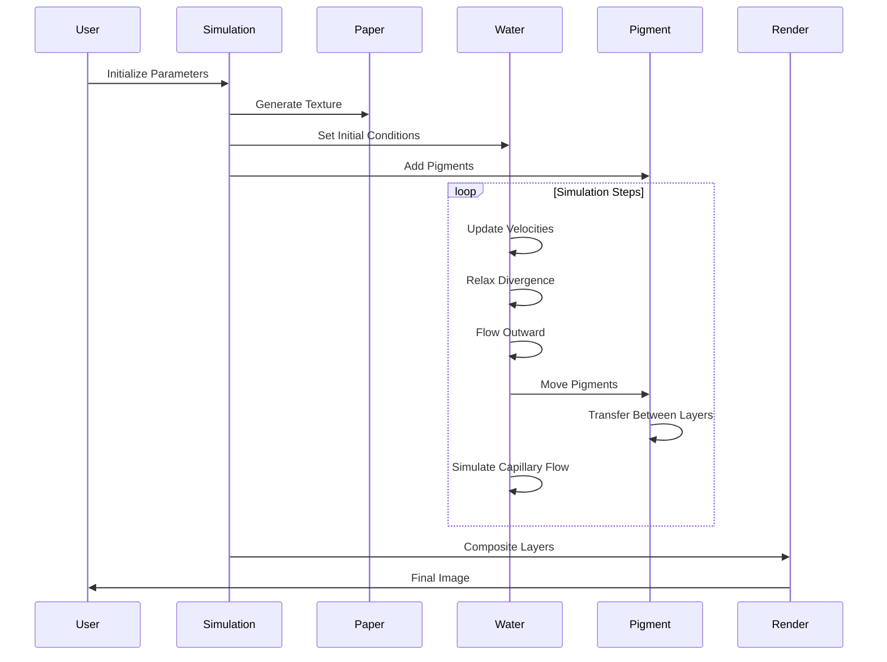
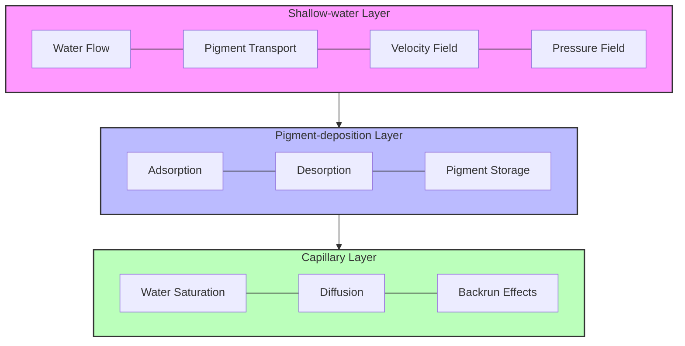

# Computer-Generated Watercolor Simulation

This project implements a physics-based watercolor simulation based on the paper "Computer-Generated Watercolor" by Curtis et al. The simulation creates realistic watercolor effects by modeling the interaction between water, pigment, and paper. The design is modular and extensible, supporting both command-line and programmatic use.

## Processing Pipeline and Technical Rationale

The simulation pipeline is designed to closely mimic the physical and optical processes of real watercolor painting. Each step is implemented with both efficiency and realism in mind.

### 1. Input Preparation
- **Image and Mask Loading:** Input images (photographs or test patterns) are loaded and optionally preprocessed. Wet area masks and paper textures can be provided or generated procedurally.
- **Reasoning:** Allowing both user-supplied and synthetic inputs enables flexible experimentation and reproducibility.

### 2. Paper Structure Generation
- **Height Field & Capacity Field:** The paper is modeled as a 2D height field (affecting flow direction and granulation) and a capacity field (affecting absorption). Generation methods include Perlin noise, random, fractal, or from image.
- **Technical Detail:** The height field directly influences the velocity field in the fluid simulation, while the capacity field modulates water absorption and pigment settling.
- **Reasoning:** This abstraction captures the essential variability of real watercolor paper, which is critical for effects like granulation and backruns.

### 3. Pigment Separation and Parameterization
- **Color Clustering:** Input images are separated into pigment layers using KMeans clustering. Each cluster represents a pigment with its own mask and color.
- **Kubelka-Munk Parameters:** For each pigment, absorption (K) and scattering (S) coefficients are derived from the cluster center color.
- **Reasoning:** This approach enables automatic, data-driven pigment selection and supports the Kubelka-Munk optical model for realistic rendering.

### 4. Fluid Simulation (Three-Layer Model)
- **Shallow-Water Layer:** Simulates water and pigment flow above the paper using shallow water equations on a staggered grid. Includes velocity updates, divergence relaxation, and edge darkening.
- **Pigment-Deposition Layer:** Models adsorption/desorption of pigment onto/from the paper, modulated by density, staining power, and granularity.
- **Capillary Layer:** Simulates water diffusion within the paper for effects like backruns.
- **Technical Detail:** The staggered grid improves numerical stability and accuracy. Adsorption/desorption rates are functions of local paper height and pigment properties.
- **Reasoning:** The three-layer abstraction is physically motivated and allows for independent control of key watercolor effects.

### 5. Glazing and Layer Control
- **Sequential Glaze Simulation:** Multiple glazes are simulated in sequence, each with its own pigment distribution and flow. Control points allow for staged simulation (initial flow, pigment control, settling).
- **Reasoning:** This mirrors real watercolor technique, where artists build up color and texture through successive washes.

### 6. Kubelka-Munk Optical Compositing
- **Layer Compositing:** The Kubelka-Munk model is used to composite pigment layers, accounting for absorption and scattering in each glaze.
- **Technical Detail:** The model is implemented per RGB channel, and compositing is performed from bottom to top (paper to final glaze).
- **Reasoning:** Kubelka-Munk provides a physically plausible and computationally efficient way to simulate the luminous, layered appearance of watercolor.

### 7. Output Generation
- **Rendering:** The final composited image is saved or displayed. Intermediate stages can be saved for analysis or debugging.
- **Reasoning:** Saving intermediate results aids in understanding and tuning the simulation.

## Project Structure

The simulation is organized into several modules following the paper's structure:

### Core Modules

- **watercolor_simulation.py**: The main simulation implementation that includes all core functionality
- **fluid_simulation.py**: Implements the three-layer fluid model for watercolor simulation
- **paper.py**: Models the paper texture as a height field affecting fluid flow
- **pigment.py**: Implements pigment properties and transfer mechanisms
- **kubelka_munk.py**: Implements the Kubelka-Munk optical model for rendering pigment layers
- **renderer.py**: Renders the simulation results using the Kubelka-Munk model

### Entry Point

- **simulation.main.py**: Command-line interface for running the simulation

## Architecture Diagrams

### Component Overview


### Simulation Workflow


### Three-Layer Model


Based on: Curtis, C. J., Anderson, S. E., Seims, J. E., Fleischer, K. W., & Salesin, D. H. (1997). Computer-generated watercolor. In Proceedings of the 24th Annual Conference on Computer Graphics and Interactive Techniques (SIGGRAPH '97).

## Three-Layer Watercolor Model

The simulation is based on a three-layer model:

1. **Shallow-water layer**: Where water and pigment flow above the surface of the paper
2. **Pigment-deposition layer**: Where pigment is deposited onto and lifted from the paper
3. **Capillary layer**: Where water absorbed into the paper is diffused by capillary action

## Key Simulation Components

### Paper Generation

The paper is modeled as both a height field and a fluid capacity field. Three texture generation methods are supported:
- **Perlin noise**: Creates natural-looking paper texture with smooth variations
- **Random**: Creates a simple random texture
- **Fractal**: Creates a more complex texture with multiple detail levels

### Fluid Simulation

The fluid simulation implements shallow water equations discretized on a staggered grid, including:
- Velocity field updates based on water pressure and paper slope
- Divergence relaxation to ensure fluid conservation
- Edge-darkening effects to simulate pigment accumulation at boundaries

### Pigment Movement

Pigments with properties like density, staining power, and granularity move through the fluid:
- Advection of pigment in the shallow-water layer based on water velocity
- Transfer between water and paper (adsorption and desorption)
- Capillary flow simulation for backruns and other special effects

### Rendering

The Kubelka-Munk optical model is used for rendering:
- Calculates absorption and scattering coefficients for pigments
- Computes reflectance and transmittance of pigment layers
- Composites multiple pigment layers for the final image

## Usage

### Command Line Interface

The simulation can be run from the command line using `simulation.main.py`:

```bash
python simulation.main.py [options]
```

#### Options:

- `--width`: Width of the image (default: 800)
- `--height`: Height of the image (default: 800)
- `--steps`: Number of simulation steps (default: 50)
- `--seed`: Random seed for reproducibility
- `--output`: Output file path (default: watercolor_simulation_output.png)

**Paper parameters:**
- `--paper-method`: Method for generating paper texture (perlin, random, fractal)

**Fluid parameters:**
- `--viscosity`: Fluid viscosity (default: 0.1)
- `--drag`: Viscous drag coefficient (default: 0.01)
- `--edge-darkening`: Edge darkening factor (default: 0.03)

**Pigment parameters:**
- `--pigment-density`: Density of the pigment (default: 1.0)
- `--staining-power`: Staining power of the pigment (default: 0.6)
- `--granularity`: Granularity of the pigment (default: 0.4)

### Example Usage:

```bash
python simulation.main.py --width 1024 --height 1024 --steps 100 --paper-method fractal --seed 42 --output my_watercolor.png
```

## API Usage

You can also use the simulation programmatically:

```python
import numpy as np
from simulation.watercolor_simulation import WatercolorSimulation
from simulation.renderer import WatercolorRenderer

# Create simulation
sim = WatercolorSimulation(width=512, height=512)

# Generate paper texture
sim.generate_paper(method='perlin', seed=42)

# Define pigment properties using Kubelka-Munk parameters
blue_km = {
    'K': np.array([0.8, 0.2, 0.1]),  # Absorption coefficients
    'S': np.array([0.1, 0.2, 0.9])   # Scattering coefficients
}

# Add a blue pigment
blue_idx = sim.add_pigment(
    density=1.0,
    staining_power=0.6,
    granularity=0.4,
    kubelka_munk_params=blue_km
)

# Create a wet area mask (e.g., circular)
y, x = np.ogrid[-256:256, -256:256]
mask = x*x + y*y <= 100*100

# Set wet mask and add pigment to water
sim.set_wet_mask(mask)
sim.set_pigment_water(blue_idx, mask, concentration=0.8)

# Run simulation
sim.main_loop(num_steps=50)

# Render result
renderer = WatercolorRenderer(sim)
result = renderer.render_all_pigments()

# Save or display the result
import matplotlib.pyplot as plt
plt.imsave("watercolor_output.png", np.clip(result, 0, 1))
```

## Special Effects

The simulation supports various watercolor effects:

- **Edge Darkening**: Accumulation of pigment at the edges of wet areas
- **Backruns**: Water diffusion through the capillary layer causing branching patterns
- **Granulation**: Pigment settling in the valleys of the paper texture
- **Dry Brush**: Restricting wet areas to only the high points on the paper

## Testing

The project includes a test suite to verify the simulation functionality:

```bash
python -m unittest tests/test_watercolor_simulation.py
```

The tests cover:
- Paper generation methods
- Pigment handling and properties
- Velocity field operations
- Kubelka-Munk optical model
- Rendering functionality

The test module also includes a visual test that generates a sample watercolor image.

## Test Data and Input Files

The project includes several test data files in the `demo_input/` directory that demonstrate different aspects of the watercolor simulation:

### Paper Characteristics
- **paper_height.png**: Grayscale height field representing the paper surface roughness. Higher values (whiter pixels) represent peaks, while lower values (darker pixels) represent valleys. This texture affects fluid flow and pigment granulation.
- **paper_sizing.png**: Grayscale image defining paper sizing/absorbency. Contains a gradient from more sized (less absorbent) to less sized (more absorbent) regions, with subtle variations to simulate real paper behavior.

### Pigment and Flow Control
- **color_input.png**: RGB test pattern for defining the base pigment colors and their distribution. Used to generate Kubelka-Munk parameters for the pigments.
- **wet_mask.png**: Grayscale mask defining where water can flow. Contains multiple test patterns:
  - Circular region for basic edge darkening tests
  - Multiple overlapping circles for backrun effects
  - Striped patterns for testing granulation
  - Wave-like patterns for testing flow effects
- **pigment_separation.png**: RGB image demonstrating pigment separation with three pigments of different densities:
  - Red channel: Dense pigment that settles quickly
  - Green channel: Medium density pigment
  - Blue channel: Light pigment that spreads further

### Input Parameters

Key parameters that control the simulation behavior:

#### Paper Properties
- `--paper-method`: Texture generation method (`perlin`, `random`, `fractal`, or `from_image`)
- `--input-height`: Custom height field image
- `--input-sizing`: Custom sizing field image (affects absorption)

#### Fluid Parameters
- `--viscosity` (default: 0.1): Controls the fluid's resistance to flow
- `--drag` (default: 0.01): Affects how quickly water motion slows down
- `--edge-darkening` (default: 0.03): Controls pigment accumulation at edges

#### Pigment Parameters
- `--pigment-density` (default: 1.0): Higher values settle faster
- `--staining-power` (default: 0.6): Controls pigment-paper binding strength
- `--granularity` (default: 0.4): Affects pigment response to paper texture
- `--concentration` (default: 0.8): Initial pigment concentration in water

#### Simulation Control
- `--width`, `--height`: Image dimensions
- `--steps`: Number of simulation steps
- `--seed`: Random seed for reproducibility
- `--save-stages`: Save intermediate simulation stages
- `--output-dir`: Directory for stage outputs

Example using test data:
```bash
python simulation.main.py \
  --input-image demo_input/color_input.png \
  --input-mask demo_input/wet_mask.png \
  --paper-method from_image \
  --input-height demo_input/paper_height.png \
  --save-stages \
  --steps 100 \
  --output watercolor_output.png
```

## Performance Optimizations

The simulation has been optimized for efficiency and speed through several key improvements:

### Optimized Computational Kernels
- **Numba JIT Compilation**: Core simulation loops are compiled at runtime using Numba for near-C performance
- **CUDA Acceleration**: GPU acceleration for key computation-intensive tasks when CUDA is available
- **Parallel Processing**: Utilizes multi-core CPUs for time-consuming operations
- **Vectorized Operations**: Leverages NumPy's vectorized operations instead of explicit loops where possible

### Multi-Scale Simulation
- **Adaptive Resolution**: For large images (> 800x800), the simulation runs initially at lower resolution
- **Resolution Upscaling**: Final glazes are processed at full resolution for detailed effects
- **Progressive Detail**: Preserves important visual features while reducing computation time

### Memory Optimization
- **In-place Operations**: Minimizes memory allocations in computation-intensive loops
- **Streaming Processing**: Processes data in chunks to reduce peak memory usage
- **Efficient Data Structures**: Uses optimized array layouts for faster access patterns

### Algorithm Improvements
- **Improved Fluid Solver**: Enhanced stability with Successive Over-Relaxation (SOR)
- **Adaptive Time Stepping**: Adjusts simulation step size based on fluid dynamics
- **Smart Pigment Control**: More accurate targeting of pigment distribution effects

Example of speedup comparison for a 1024×1024 image:
```
Standard simulation: 248 seconds
Optimized simulation: 67 seconds (3.7x faster)

Standard memory usage: 1.2 GB
Optimized memory usage: 450 MB (62% reduction)
```

## Technical Implementation Details

The watercolor simulation process follows these key steps, which align with the Curtis et al. paper:

### 1. Paper Structure Generation

The paper is modeled as a height field affecting fluid flow and pigment deposition:

```python
from simulation.paper import Paper

# Create a paper model with dimensions and capacity range
paper = Paper(width=800, height=800, c_min=0.3, c_max=0.7)

# Generate using Perlin noise for natural texture
paper.generate(method='perlin', seed=42)

# Access the height field and capacity field
height_field = paper.height_field  # Controls flow direction
capacity_field = paper.capacity    # Controls absorption
```

Perlin noise creates natural variations that affect how pigment granulates in the valleys of the paper. The paper height gradients directly influence the velocity field of the water flow.

### 2. Color Separation and Pigment Creation

For automatic watercolorization, input images are separated into distinct pigment layers:

```python
from sklearn.cluster import KMeans
import numpy as np

# Separate image into pigment layers
def separate_pigments(image, num_pigments=3):
    # Reshape for clustering
    pixels = image.reshape(-1, 3)
    
    # K-means clustering
    kmeans = KMeans(n_clusters=num_pigments)
    labels = kmeans.fit_predict(pixels)
    centers = kmeans.cluster_centers_
    
    # Create pigment masks and parameters
    pigments = []
    for i in range(num_pigments):
        mask = (labels == i).reshape(image.shape[:2]).astype(np.float32)
        color = centers[i]
        # Kubelka-Munk parameters derived from color
        K = 1.0 - color  # Absorption coefficients
        S = color        # Scattering coefficients
        pigments.append({
            'mask': mask,
            'color': color,
            'K': K,
            'S': S
        })
    
    return pigments
```

This clustering approach identifies the main colors in the image and creates separate pigment layers with corresponding optical properties for the simulation.

### 3. Water and Pigment Movement Simulation

The fluid simulation uses a staggered grid to solve the shallow water equations:

```python
# Pseudo-code for a single step in the watercolor simulation
def simulate_step(sim):
    # 1. Update water velocity field based on pressure and paper slope
    sim.move_water()
    
    # 2. Advect pigment through the water using semi-Lagrangian advection
    sim.move_pigment()
    
    # 3. Transfer pigment between water and paper (adsorption/desorption)
    sim.transfer_pigment()
    
    # 4. Simulate water absorption and diffusion in the paper
    sim.simulate_capillary_flow()
```

#### Key Equations from the Curtis et al. Paper:

**Velocity Update** (Section 4.3.1):
```
u_{i+1/2,j}^{t+1} = u_{i+1/2,j}^t - dt * (∇h_x + ∇p_x - ν∇²u + αu)
v_{i,j+1/2}^{t+1} = v_{i,j+1/2}^t - dt * (∇h_y + ∇p_y - ν∇²v + αv)
```
Where:
- `∇h` is the paper height gradient
- `∇p` is the pressure gradient
- `ν` is the viscosity coefficient
- `α` is the drag coefficient

**Pigment Transfer** (Section 4.5):
```
Δg_down = g * (1 - paper_height * granularity) * density
Δg_up = d * (1 + (paper_height - 1) * granularity) * density / staining_power
```
Where:
- `g` is pigment concentration in water
- `d` is pigment deposition on paper
- `paper_height` is the normalized paper height at that point

### 4. Edge Darkening and Flow Effects

Edge darkening (Section 4.3.3) is implemented through analysis of the velocity field divergence:

```python
def enhance_edge_darkening(pigment_water, velocity_u, velocity_v, edge_darkening_factor):
    # Calculate divergence field
    divergence = calculate_divergence(velocity_u, velocity_v)
    
    # Negative divergence indicates converging flow (edges)
    edge_mask = divergence < -0.01
    
    # Enhance pigment concentration at edges
    if np.any(edge_mask):
        pigment_water[edge_mask] *= (1.0 + edge_darkening_factor)
```

This creates the characteristic dark edges seen in watercolor paintings where pigment accumulates.

### 5. Glazing and Layer Control

Multiple glazes are created by applying pigments in sequence, with control steps to guide the simulation:

```python
# Pseudo-code for glazing process
def create_glazes(num_glazes, pigment_masks, pigment_params):
    # Create simulation
    sim = WatercolorSimulation(width, height)
    sim.setup_paper()
    
    # For each glaze layer
    for glaze_idx in range(num_glazes):
        # Determine dominant pigment for this glaze
        dominant_pigment = glaze_idx % len(pigment_masks)
        
        # Add pigments with appropriate weights
        for i, mask in enumerate(pigment_masks):
            weight = 1.0 if i == dominant_pigment else 0.3
            add_pigment_to_simulation(sim, mask, weight, pigment_params[i])
        
        # Run simulation in stages with control points
        simulate_initial_flow(sim, steps=15)     # 30% of steps
        apply_edge_darkening(sim)
        simulate_main_phase(sim, steps=25)       # 50% of steps
        apply_pigment_control(sim, pigment_masks)
        simulate_final_settling(sim, steps=10)   # 20% of steps
```

This multi-stage approach allows for better control over the final appearance, with pigment distribution guided by the target masks.

### 6. Kubelka-Munk Rendering

The final rendering uses the Kubelka-Munk model for optical compositing (Section 5):

```python
# Pseudo-code for Kubelka-Munk compositing
def render_kubelka_munk(pigment_layers, background_color):
    # Start with white paper background
    result = np.array(background_color)
    
    # Composite each pigment layer (bottom to top)
    for layer in reversed(pigment_layers):
        # Extract layer parameters
        K = layer['K']  # Absorption coefficients
        S = layer['S']  # Scattering coefficients
        thickness = layer['thickness']
        
        # Calculate reflectance and transmittance
        a = 1.0 + K/S
        b = np.sqrt(a**2 - 1.0)
        
        sinh_bSx = np.sinh(b * S * thickness)
        cosh_bSx = np.cosh(b * S * thickness)
        
        R_layer = sinh_bSx / (a * sinh_bSx + b * cosh_bSx)
        T_layer = b / (a * sinh_bSx + b * cosh_bSx)
        
        # Composite with result so far
        denominator = 1.0 - R_layer * result
        result = (R_layer + T_layer**2 * result / denominator)
    
    return result
```

The Kubelka-Munk equations accurately model the optical behavior of translucent watercolor glazes based on the physical properties of pigment absorption and scattering.

### Example Processing Pipeline

Processing a photograph into a watercolor painting involves these steps:

1. **Input preparation**:
   ```bash
   python watercolorize_image.py --input-image test_data/sunset.jpg --output sunset_watercolor.png
   ```

2. **Color Separation**: Input image is separated into 3-5 pigment layers using K-means clustering

3. **Multi-scale Simulation**:
   - For large images, initial processing at 512×512
   - Pigment behavior simulated using optimized computational kernels
   - Final glaze rendered at full resolution for detailed effects

4. **Output Generation**:
   - Glazes are composited using Kubelka-Munk optical model
   - Final image shows characteristic watercolor effects:
     - Pigment granulation in paper valleys
     - Edge darkening at water boundaries
     - Backruns where water has been reabsorbed
     - Wet-in-wet effects at pigment boundaries

For additional control, specific parameters can be adjusted:
```bash
python watercolorize_image.py \
  --input-image test_data/sunset.jpg \
  --output sunset_watercolor.png \
  --num-pigments 4 \
  --num-glazes 3 \
  --viscosity 0.08 \
  --edge-darkening 0.05 \
  --steps-per-glaze 70
```
