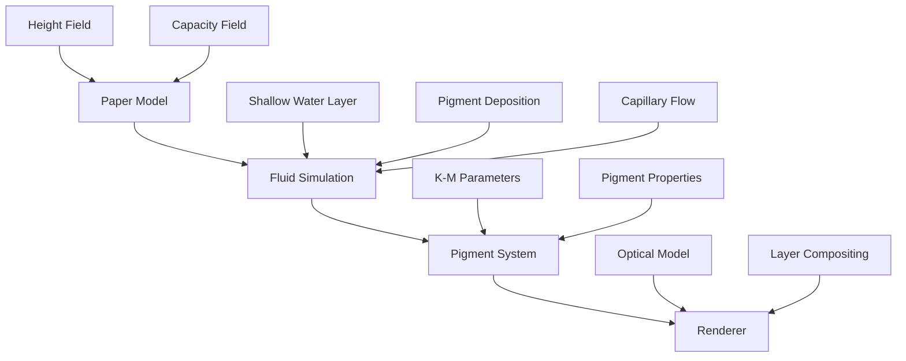
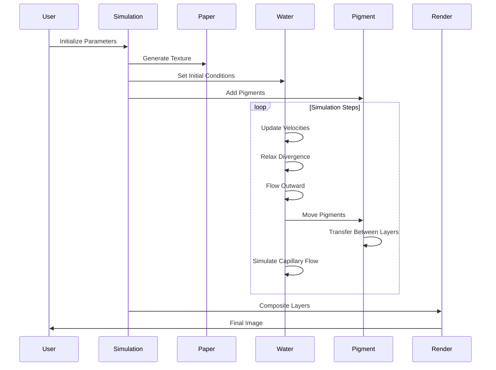
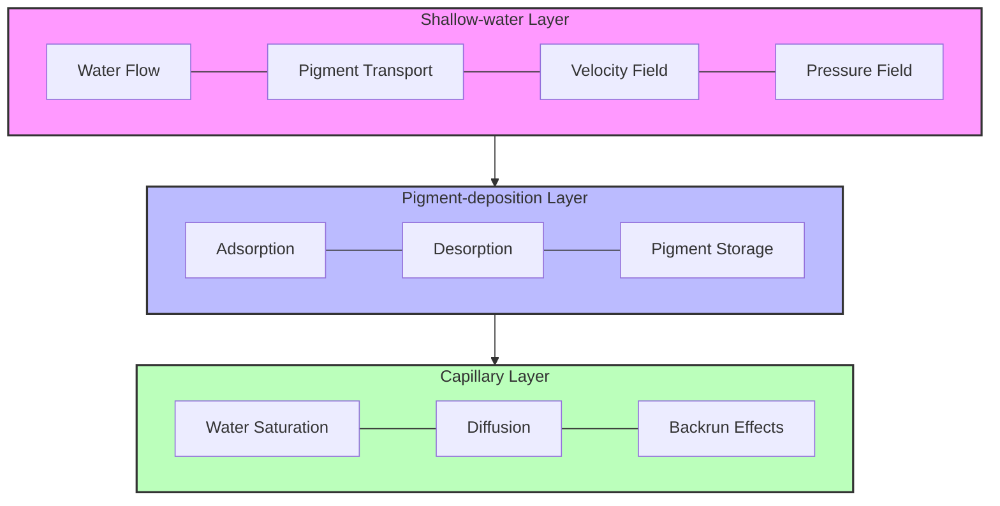

# Computer-Generated Watercolor Simulation

This project implements a physics-based watercolor simulation based on the paper "Computer-Generated Watercolor" by Curtis et al. The simulation creates realistic watercolor effects by modeling the interaction between water, pigment, and paper.

## Project Structure

The simulation is organized into several modules following the paper's structure:

### Core Modules

- **watercolor_simulation.py**: The main simulation implementation that includes all core functionality
- **fluid_simulation.py**: Implements the three-layer fluid model for watercolor simulation
- **paper.py**: Models the paper texture as a height field affecting fluid flow
- **pigment.py**: Implements pigment properties and transfer mechanisms
- **kubelka_munk.py**: Implements the Kubelka-Munk optical model for rendering pigment layers
- **renderer.py**: Renders the simulation results using the Kubelka-Munk model

### Entry Point

- **simulation_main.py**: Command-line interface for running the simulation

## Architecture Diagrams

### Component Overview


### Simulation Workflow


### Three-Layer Model


Based on: Curtis, C. J., Anderson, S. E., Seims, J. E., Fleischer, K. W., & Salesin, D. H. (1997). Computer-generated watercolor. In Proceedings of the 24th Annual Conference on Computer Graphics and Interactive Techniques (SIGGRAPH '97).

## Three-Layer Watercolor Model

The simulation is based on a three-layer model:

1. **Shallow-water layer**: Where water and pigment flow above the surface of the paper
2. **Pigment-deposition layer**: Where pigment is deposited onto and lifted from the paper
3. **Capillary layer**: Where water absorbed into the paper is diffused by capillary action

## Key Simulation Components

### Paper Generation

The paper is modeled as both a height field and a fluid capacity field. Three texture generation methods are supported:
- **Perlin noise**: Creates natural-looking paper texture with smooth variations
- **Random**: Creates a simple random texture
- **Fractal**: Creates a more complex texture with multiple detail levels

### Fluid Simulation

The fluid simulation implements shallow water equations discretized on a staggered grid, including:
- Velocity field updates based on water pressure and paper slope
- Divergence relaxation to ensure fluid conservation
- Edge-darkening effects to simulate pigment accumulation at boundaries

### Pigment Movement

Pigments with properties like density, staining power, and granularity move through the fluid:
- Advection of pigment in the shallow-water layer based on water velocity
- Transfer between water and paper (adsorption and desorption)
- Capillary flow simulation for backruns and other special effects

### Rendering

The Kubelka-Munk optical model is used for rendering:
- Calculates absorption and scattering coefficients for pigments
- Computes reflectance and transmittance of pigment layers
- Composites multiple pigment layers for the final image

## Usage

### Command Line Interface

The simulation can be run from the command line using `simulation_main.py`:

```bash
python simulation_main.py [options]
```

#### Options:

- `--width`: Width of the image (default: 800)
- `--height`: Height of the image (default: 800)
- `--steps`: Number of simulation steps (default: 50)
- `--seed`: Random seed for reproducibility
- `--output`: Output file path (default: watercolor_simulation_output.png)

**Paper parameters:**
- `--paper-method`: Method for generating paper texture (perlin, random, fractal)

**Fluid parameters:**
- `--viscosity`: Fluid viscosity (default: 0.1)
- `--drag`: Viscous drag coefficient (default: 0.01)
- `--edge-darkening`: Edge darkening factor (default: 0.03)

**Pigment parameters:**
- `--pigment-density`: Density of the pigment (default: 1.0)
- `--staining-power`: Staining power of the pigment (default: 0.6)
- `--granularity`: Granularity of the pigment (default: 0.4)

### Example Usage:

```bash
python simulation_main.py --width 1024 --height 1024 --steps 100 --paper-method fractal --seed 42 --output my_watercolor.png
```

## API Usage

You can also use the simulation programmatically:

```python
import numpy as np
from simulation.watercolor_simulation import WatercolorSimulation
from simulation.renderer import WatercolorRenderer

# Create simulation
sim = WatercolorSimulation(width=512, height=512)

# Generate paper texture
sim.generate_paper(method='perlin', seed=42)

# Define pigment properties using Kubelka-Munk parameters
blue_km = {
    'K': np.array([0.8, 0.2, 0.1]),  # Absorption coefficients
    'S': np.array([0.1, 0.2, 0.9])   # Scattering coefficients
}

# Add a blue pigment
blue_idx = sim.add_pigment(
    density=1.0,
    staining_power=0.6,
    granularity=0.4,
    kubelka_munk_params=blue_km
)

# Create a wet area mask (e.g., circular)
y, x = np.ogrid[-256:256, -256:256]
mask = x*x + y*y <= 100*100

# Set wet mask and add pigment to water
sim.set_wet_mask(mask)
sim.set_pigment_water(blue_idx, mask, concentration=0.8)

# Run simulation
sim.main_loop(num_steps=50)

# Render result
renderer = WatercolorRenderer(sim)
result = renderer.render_all_pigments()

# Save or display the result
import matplotlib.pyplot as plt
plt.imsave("watercolor_output.png", np.clip(result, 0, 1))
```

## Special Effects

The simulation supports various watercolor effects:

- **Edge Darkening**: Accumulation of pigment at the edges of wet areas
- **Backruns**: Water diffusion through the capillary layer causing branching patterns
- **Granulation**: Pigment settling in the valleys of the paper texture
- **Dry Brush**: Restricting wet areas to only the high points on the paper

## Testing

The project includes a test suite to verify the simulation functionality:

```bash
python -m unittest tests/test_watercolor_simulation.py
```

The tests cover:
- Paper generation methods
- Pigment handling and properties
- Velocity field operations
- Kubelka-Munk optical model
- Rendering functionality

The test module also includes a visual test that generates a sample watercolor image.

## Test Data and Input Files

The project includes several test data files in the `demo_input/` directory that demonstrate different aspects of the watercolor simulation:

### Paper Characteristics
- **paper_height.png**: Grayscale height field representing the paper surface roughness. Higher values (whiter pixels) represent peaks, while lower values (darker pixels) represent valleys. This texture affects fluid flow and pigment granulation.
- **paper_sizing.png**: Grayscale image defining paper sizing/absorbency. Contains a gradient from more sized (less absorbent) to less sized (more absorbent) regions, with subtle variations to simulate real paper behavior.

### Pigment and Flow Control
- **color_input.png**: RGB test pattern for defining the base pigment colors and their distribution. Used to generate Kubelka-Munk parameters for the pigments.
- **wet_mask.png**: Grayscale mask defining where water can flow. Contains multiple test patterns:
  - Circular region for basic edge darkening tests
  - Multiple overlapping circles for backrun effects
  - Striped patterns for testing granulation
  - Wave-like patterns for testing flow effects
- **pigment_separation.png**: RGB image demonstrating pigment separation with three pigments of different densities:
  - Red channel: Dense pigment that settles quickly
  - Green channel: Medium density pigment
  - Blue channel: Light pigment that spreads further

### Input Parameters

Key parameters that control the simulation behavior:

#### Paper Properties
- `--paper-method`: Texture generation method (`perlin`, `random`, `fractal`, or `from_image`)
- `--input-height`: Custom height field image
- `--input-sizing`: Custom sizing field image (affects absorption)

#### Fluid Parameters
- `--viscosity` (default: 0.1): Controls the fluid's resistance to flow
- `--drag` (default: 0.01): Affects how quickly water motion slows down
- `--edge-darkening` (default: 0.03): Controls pigment accumulation at edges

#### Pigment Parameters
- `--pigment-density` (default: 1.0): Higher values settle faster
- `--staining-power` (default: 0.6): Controls pigment-paper binding strength
- `--granularity` (default: 0.4): Affects pigment response to paper texture
- `--concentration` (default: 0.8): Initial pigment concentration in water

#### Simulation Control
- `--width`, `--height`: Image dimensions
- `--steps`: Number of simulation steps
- `--seed`: Random seed for reproducibility
- `--save-stages`: Save intermediate simulation stages
- `--output-dir`: Directory for stage outputs

Example using test data:
```bash
python simulation_main.py \
  --input-image demo_input/color_input.png \
  --input-mask demo_input/wet_mask.png \
  --paper-method from_image \
  --input-height demo_input/paper_height.png \
  --save-stages \
  --steps 100 \
  --output watercolor_output.png
```
